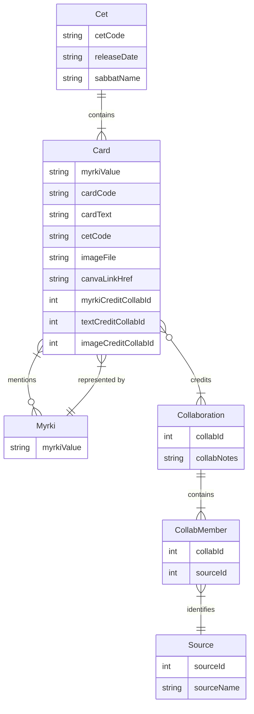

Cards, released in Cets, are connected to one another through mentions in their text, and are each instances of a Myrki. Each card has only one Myrki it represents, but its text will often mention how it relates to other Myrkis, and thus is connected to other cards. All cards have a single identifying Myrki, a Myrki can and most often will be manifested through many Cards (this is the point, each card is a facet of that Myrki Truth)

Cards have credited Collaborations for where their components came from (as Cards can be "remixed" again and again). A collaboration is one or more Sources working together on a particular component (the text, the image, or the myrki itself, whomever suggested the myrki gets collaboration credit even if someone else came up with the text and the image). AI has been used to create most of the images, but we want to allow people to create their own representations of concepts and to allow AI art to be a placeholder for future inspirations. For this reason, we use this tracking to clarify where things were AI generated or where a collaboration of humans and AI was used (eg. AI snippets arranged manually and manipulated by a human in a collage). 

We believe in giving credit where credit is due, and envision a future where AI and Human Composition can live side by side, each challenging and enriching the other.

