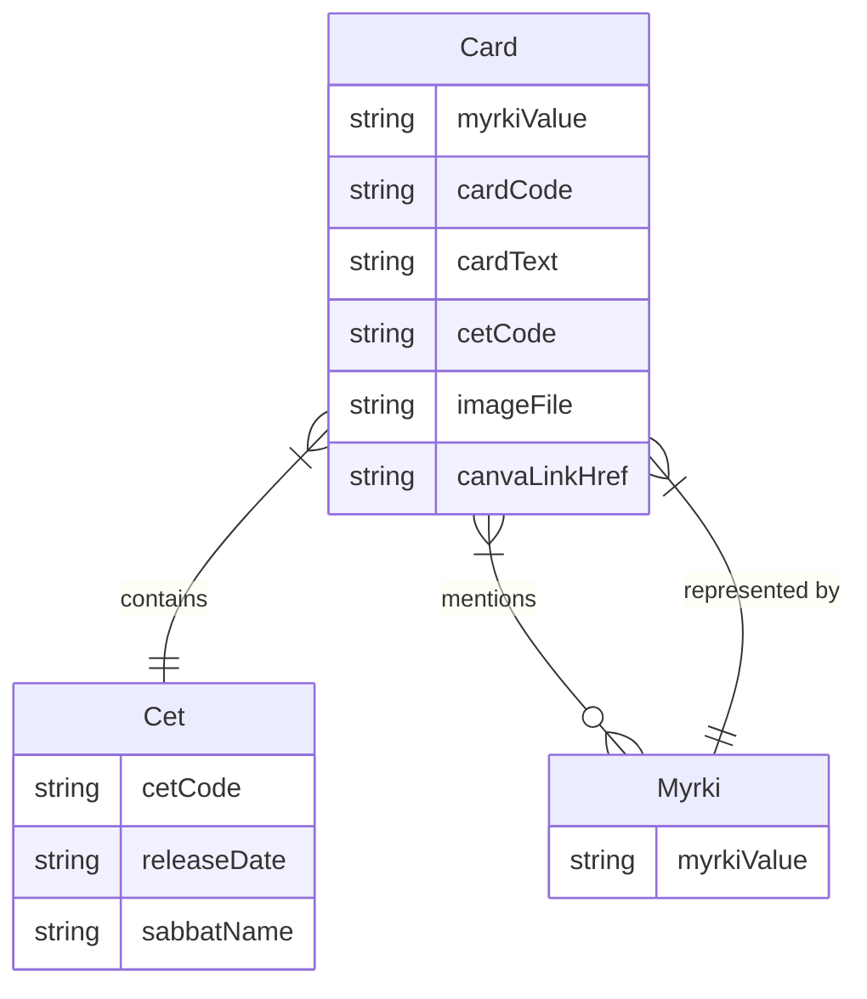

Cards, released in Cets, are connected to one another through mentions in their text, and are each instances of a Myrki. Each card has only one Myrki it represents, but its text will often mention how it relates to other Myrkis, and thus is connected to other cards. All cards have a single identifying Myrki, a Myrki can and most often will be manifested through many Cards (this is the point, each card is a facet of that Myrki Truth)

